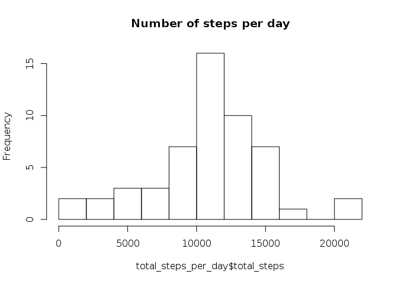

# Reproducible Research: Peer Assessment 1


## Loading and preprocessing the data

To load the dataset we first need to extract to source zip file. Note that we only perfom this step if the activity.csv file doesn't exist yet:


```r
if(!file.exists("activity.csv"))
{
  print("Extracting activity dataset...")
  unzip("activity.zip");
}
```

Load we can load the dataset and preprocess it. First we will format the date column into POSIXct values:


```r
data <- read.csv("activity.csv")
data$date <- as.POSIXct(data$date)
```

## What is mean total number of steps taken per day?

To compute the mean total number of steps taken per day we first need to compute the total number of steps for each day.
This can be achieved with the dplyr and summarise functions:


```r
library(plyr)
total_steps_per_day <- ddply(data,"date",summarize,total_steps=sum(steps))
head(total_steps_per_day,10)
```

```
##          date total_steps
## 1  2012-10-01          NA
## 2  2012-10-02         126
## 3  2012-10-03       11352
## 4  2012-10-04       12116
## 5  2012-10-05       13294
## 6  2012-10-06       15420
## 7  2012-10-07       11015
## 8  2012-10-08          NA
## 9  2012-10-09       12811
## 10 2012-10-10        9900
```

Let's now display an histogram of the total number of steps per day:


```r
hist(total_steps_per_day$total_steps,breaks=10, main="Number of steps per day")
```



Finaly we can compute the mean of the total number of steps simply ignoring the NA values, as well as the median value:


```r
mean_tot_steps <- mean(total_steps_per_day$total_steps, na.rm = T)
mean_tot_steps
```

```
## [1] 10766.19
```

```r
med <- median(total_steps_per_day$total_steps, na.rm = T)
med
```

```
## [1] 10765
```

The mean of the total number of steps per day is of about 10766 steps, whereas the median value is around 10765

## What is the average daily activity pattern?


## Imputing missing values


## Are there differences in activity patterns between weekdays and weekends?
