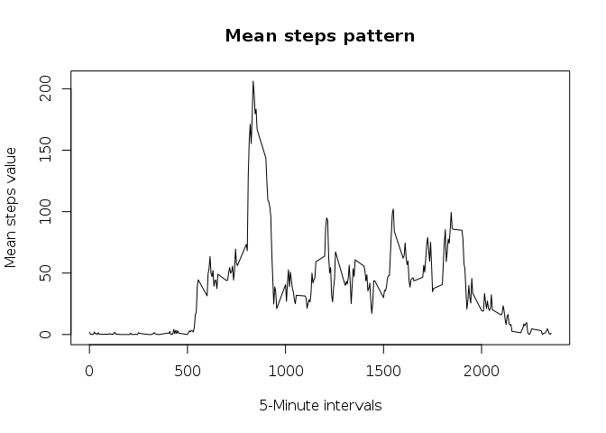
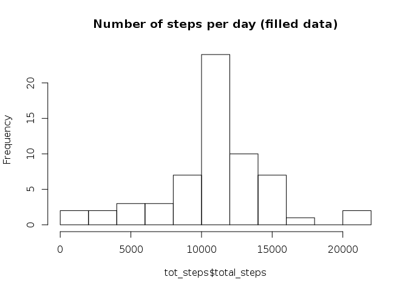

# Reproducible Research: Peer Assessment 1


## Loading and preprocessing the data

To load the dataset we first need to extract to source zip file. Note that we only perfom this step if the activity.csv file doesn't exist yet:


```r
if(!file.exists("activity.csv"))
{
  print("Extracting activity dataset...")
  unzip("activity.zip");
}
```

Load we can load the dataset and preprocess it. First we will format the date column into POSIXct values:


```r
data <- read.csv("activity.csv")
data$date <- as.POSIXct(data$date)
head(data,10)
```

```
##    steps       date interval
## 1     NA 2012-10-01        0
## 2     NA 2012-10-01        5
## 3     NA 2012-10-01       10
## 4     NA 2012-10-01       15
## 5     NA 2012-10-01       20
## 6     NA 2012-10-01       25
## 7     NA 2012-10-01       30
## 8     NA 2012-10-01       35
## 9     NA 2012-10-01       40
## 10    NA 2012-10-01       45
```

## What is mean total number of steps taken per day?

To compute the mean total number of steps taken per day we first need to compute the total number of steps for each day.
This can be achieved with the dplyr and summarise functions:


```r
library(plyr)
total_steps_per_day <- ddply(data,"date",summarize,total_steps=sum(steps))
head(total_steps_per_day,10)
```

```
##          date total_steps
## 1  2012-10-01          NA
## 2  2012-10-02         126
## 3  2012-10-03       11352
## 4  2012-10-04       12116
## 5  2012-10-05       13294
## 6  2012-10-06       15420
## 7  2012-10-07       11015
## 8  2012-10-08          NA
## 9  2012-10-09       12811
## 10 2012-10-10        9900
```

Let's now display an histogram of the total number of steps per day:


```r
hist(total_steps_per_day$total_steps,breaks=10, main="Number of steps per day")
```


Finaly we can compute the mean of the total number of steps simply ignoring the NA values, as well as the median value:


```r
mean_tot_steps <- mean(total_steps_per_day$total_steps, na.rm = T)
mean_tot_steps
```

```
## [1] 10766.19
```

```r
med <- median(total_steps_per_day$total_steps, na.rm = T)
med
```

```
## [1] 10765
```

The mean of the total number of steps per day is of about 10766 steps, whereas the median value is around 10765

## What is the average daily activity pattern?

To answer this question we start with building the mean number of steps for each 5 minutes chunk:


```r
mean_pat <- ddply(data,"interval",summarize,mean_steps=mean(steps, na.rm = T))
head(mean_pat,10)
```

```
##    interval mean_steps
## 1         0  1.7169811
## 2         5  0.3396226
## 3        10  0.1320755
## 4        15  0.1509434
## 5        20  0.0754717
## 6        25  2.0943396
## 7        30  0.5283019
## 8        35  0.8679245
## 9        40  0.0000000
## 10       45  1.4716981
```

Now we can plot this mean steps per day partern, and subsequently compute the maximum mean step value


```r
# Compute the max mean step value and the corresponding interval:
plot(x=mean_pat$interval,y=mean_pat$mean_steps, type='l',main="Mean steps pattern",
     xlab="5-Minute intervals", ylab="Mean steps value")
```



```r
maxi <- max(mean_pat$mean_steps)
maxint <- mean_pat$interval[mean_pat$mean_steps == maxi]

# compute the corresponding day time:
hours <- floor(maxint/60.0)
mins <- maxint - hours*60

daytime <- sprintf("%02d:%02d", hours,mins)
```


As reported in the previous plot the maximum number of mean steps is of 206.1698113, and it is detected here in the interval 835, which correspond to the day time of 13:55 (assuming that the interval 0 corresponds to time 00:00).


## Imputing missing values

Let's now compute the number of rows where we have NA values:


```r
numna <- sum(is.na(data$steps))
numna
```

```
## [1] 2304
```

```r
# compute the proportion of NA:
prop <- sprintf("%.2f",100.0*numna/dim(data)[1])
```

In this dataset we have 2304 NA rows, which represents 13.11% of the available data.


Lets now fill those missing data in the dataset: for each row where we have an NA steps value, we will simply replace this NA value with the mean steps value corresponding to that 5 minutes interval:


```r
# create a copy of the dataset:
filled_data <- data

# Fill the missing data we a simple for loop:
steps <- data$steps
for(i in seq_along(steps))
{
  if(is.na(steps[i]))
  {
    steps[i] <- mean_pat$mean_steps[mean_pat$interval == data$interval[i]]
  }
}

filled_data$steps <- steps
head(filled_data,10)
```

```
##        steps       date interval
## 1  1.7169811 2012-10-01        0
## 2  0.3396226 2012-10-01        5
## 3  0.1320755 2012-10-01       10
## 4  0.1509434 2012-10-01       15
## 5  0.0754717 2012-10-01       20
## 6  2.0943396 2012-10-01       25
## 7  0.5283019 2012-10-01       30
## 8  0.8679245 2012-10-01       35
## 9  0.0000000 2012-10-01       40
## 10 1.4716981 2012-10-01       45
```

Now we build a new histogram from the filled dataset:


```r
tot_steps <- ddply(filled_data,"date",summarize,total_steps=sum(steps))
hist(tot_steps$total_steps,breaks=10, main="Number of steps per day (filled data)")
```



```r
tot_mean <- mean(tot_steps$total_steps)
tot_mean
```

```
## [1] 10766.19
```

```r
tot_med <- median(tot_steps$total_steps)
tot_med
```

```
## [1] 10766.19
```

We observe almost the same values for the mean and median values when using this filled dataset. So filling the missing values seem to have basically no effect in this case.


## Are there differences in activity patterns between weekdays and weekends?
